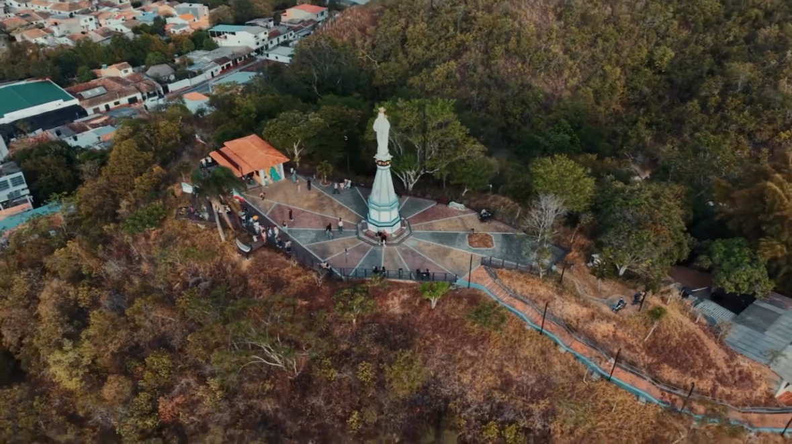

# 🌄 El Mirador del Cielo | Landing Page Web Premium

Landing Page oficial e interactiva de nivel profesional para **El Mirador del Cielo**, un emblemático mirador gastronómico y turístico ubicado en el Cerro del Monumento en **Río de Oro, Cesar (Colombia)**.



---

## 🚀 Características Principales

- 🌙 **Diseño Slate Night Mode (`#0B0F17`) & Glassmorphism**: Estética nocturna ultra elegante, moderna y de gran contraste con destellos ámbar y naranja (`glass-glow`).
- 🌅 **Widget de "Hora Dorada & Atardecer" en Tiempo Real**: Indicador activo en el Hero que calcula la hora del atardecer en Río de Oro e informa a los usuarios sobre la mejor luz para fotos.
- 🛒 **Carrito de Pedidos Interactivo (`Order Builder WhatsApp`)**:
  - Selector de cantidades (`+` / `-`) para granizados, pizzetas, empanadas y souvenirs.
  - Opciones de consumo: *En Mesa en el Mirador* o *Para Llevar / Recoger*.
  - Cálculo del subtotal y total acumulado en tiempo real.
  - Envió del pedido estructurado con resumen de productos directamente a WhatsApp.
- 🖼️ **Visor Lightbox de Galería a Pantalla Completa**:
  - Modal interactivo con zoom de imágenes high-resolution.
  - Navegación por teclado (Flechas `←` `→` y tecla `ESC`).
  - Contador de fotos y descripción detallada.
- 📅 **Sistema de Reserva de Mesas & Celebraciones**:
  - Formulario desplegable para agendar visitas (Fecha, Hora, Nº de Personas y Ocasión especial).
  - Enlace rápido a WhatsApp con la información pre-diligenciada.
- 🍕 **Sección de Menú con Filtros de Categoría**:
  - Pestañas interactivas (*Todos*, *Granizados & Bebidas*, *Platos & Snacks*, *Souvenirs*).
- ⭐ **Sección de Reseñas & Prueba Social**:
  - Valoración 4.9 ★★★★★ basada en Google Maps & TripAdvisor.
- 📌 **Barra de Navegación Flotante Inteligente**: Resaltado automático de sección activa al hacer scroll y menú hamburguesa responsive.
- 💬 **Botón Flotante de WhatsApp con Tooltip Inteligente**: Botón fijo con destello animado y mensaje emergente.
- ❓ **Acordeón de FAQ Inteligente**: Acordeón interactivo en JS.
- 📍 **Mapa Interactivo de Google Maps**: Ubicación exacta en el Cerro del Monumento.

---

## 🛠️ Tecnologías Utilizadas

- **HTML5**: Estructura semántica accesible y SEO optimizada.
- **Tailwind CSS** (vía CDN): Sistema de utilidades visuales, glassmorphism overlays y responsividad avanzada.
- **JavaScript (ES6+)**: Lógica reactiva para carrito de compras, lightbox modal, widget de horario solar y filtros de categoría.
- **Google Fonts**: Tipografías *Playfair Display* (títulos serif) y *Montserrat* (cuerpo de texto).
- **AOS (Animate On Scroll)**: Animaciones fluidas al hacer scroll.

---

## 📁 Estructura del Proyecto

```text
MIRADOR DEL CIELO/
├── images/
│   ├── granizados.jpeg      # Imagen de Granizados Artesanales
│   ├── pizzeta.jpeg         # Imagen de Pizzeta Artesanal
│   ├── empanadas.jpeg       # Imagen de Empanadas Crocantes
│   ├── monumento.png        # Imagen panorámica del Cerro del Monumento
│   ├── pin00.jpeg           # Imagen poster para el video
│   ├── pin01.png            # Pin Fachada Local
│   ├── pin02.png            # Pin Jaguar Río de Oro (368 años)
│   └── video.mp4            # Video promocional de fondo
├── index.html               # Aplicación principal
└── README.md                # Documentación del proyecto
```

---

## ⚙️ Cómo Ejecutar Localmente

1. Clona o descarga este repositorio en tu equipo:
   ```bash
   git clone https://github.com/tu-usuario/mirador-del-cielo.git
   ```
2. Navega al directorio del proyecto:
   ```bash
   cd "MIRADOR DEL CIELO"
   ```
3. Abre el archivo `index.html` directamente en tu navegador preferido o utiliza **Live Server** en VS Code.

---

## 📄 Licencia & Créditos

© 2026 **El Mirador del Cielo**. Todos los derechos reservados.  
Desarrollado para la promoción turística y comercial de Río de Oro, Cesar.
